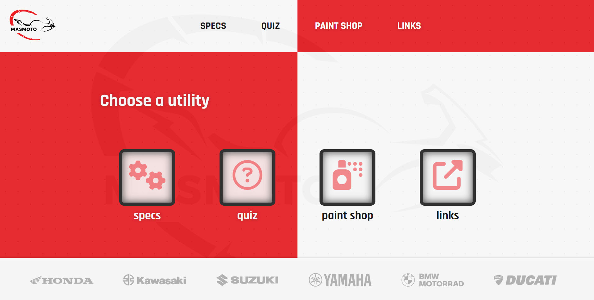
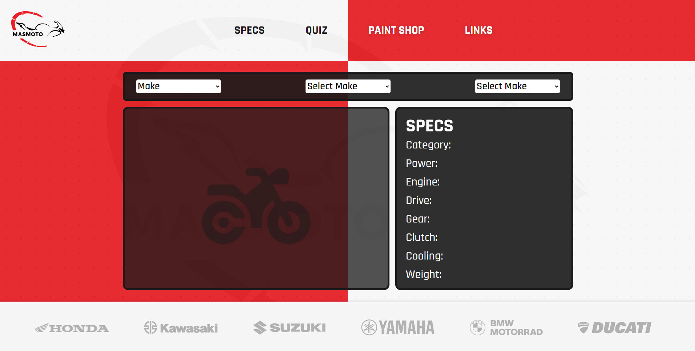
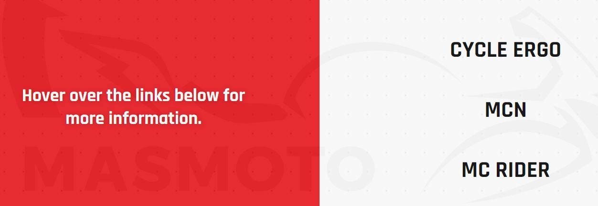

# MASMOTO Website

The MASMOTO website is designed to be a responsive website allowing visitors to view it on a range of devices. It allows visitors to find relevant information about motorcycles.

[View MasMoto on Github Pages](https://ahmadalmasridev.github.io/masmoto/index.html)

---

## CONTENTS

- [MASMOTO Website](#masmoto-website)
  - [**CONTENTS**](#contents)
  - [**User Experience (UX)**](#user-experience-ux)
    - [Initial Discussion](#initial-discussion)
    - [User Stories](#user-stories)
  - [**Design**](#design)
    - [Color Scheme](#color-scheme)
    - [Typography](#typography)
    - [Imagery](#imagery)
    - [Features](#features)
    - [General features on each page](#general-features-on-each-page)
    - [Accessibility](#accessibility)
  - [**Technologies Used**](#technologies-used)
    - [Languages Used](#languages-used)
    - [Frameworks, Libraries \& Programs Used](#frameworks-libraries--programs-used)
  - [**Deployment \& Local Development**](#deployment--local-development)
    - [Deployment](#deployment)
    - [Local Development](#local-development)
      - [How to Fork](#how-to-fork)
      - [How to Clone](#how-to-clone)
  - [**Testing**](#testing)
  - [**Credits**](#credits)
    - [Code Used](#code-used)
    - [Content](#content)
    - [ Media](#media)
    - [ Acknowledgments](#acknowledgments)

---

## **User Experience (UX)**

 

### **Initial Discussion**

The MasMoto website is an information portal mostly for new riders, it contains information on motorcycles specs, a simple quiz, a virtual paint shop, and some useful links for beginners.
It can be also interesting for experience riders also, the specs section and the paint shop.

Key information for the site

- Motorcycles specs with detailed info and photos.
- Virtual paint shop.
- A simple interesting quiz.
- Some useful links for beginners.
- Links to the major motorcycle manufacturers websites.

### **User Stories**

**Visitor Goals**

- To be able to view the site on a range of device sizes.
- To be able to navigate through the website with ease.
- To be able to test ones knowledge regarding riding motorcycles.
- To provide the user with relevant information regarding motorcycles.
- To provide the user with motorcycle painting scheme suggestions.

**First Time Visitor Goals**

- I want to know what type of motorcycle I want.
- I want to see some photos of motorcycles.
- I want to check a motorcycle specs.
- I want to find a suitable paintjob for me.
- I want to check some useful links.

**Returning Visitor Goals**

- I want to check a motorcycle specs.
- I want to find a suitable paintjob for me.
- I want to check some useful links.

---

## **Design**

 

The initial design was inspired by one website template online,
I have credited these in the [credits](#credits) section.

### **Color Scheme**

The website uses a palette of red and gray shades inspired from racing sport, The color palette was created using the [Coolors](https://coolors.co) website.

### **Typography**

The following font from [Google Fonts](https://fonts.google.com/) was used:

Rajdhani font is used for all the website.

### **Imagery**

The images used were downloaded from various websites mostly motorcycles manufacturers and serve as an imitation of an API service with images.

Wireframes were created with [Balsamiq](https://balsamiq.com) Wireframes program.

Home Page Wireframe 

Specs Page Wireframe 

Quiz Page Wireframe 

At the beginning I was not planning to make a separate links page, but in the process I decided to make one, so there is no wireframe for the links page.  
 

### **Features**

The website consist of five pages, each page is a utility that provide the user with some kind of information navigation menu.
The home page contains icons of each of the four utilities and each icon links the user with the relevant page.
The user can also access these utilities directly from the navigation bar.

- All Pages on the website have:

  - A responsive navigation bar at the top which allows the user to navigate through the website. To the left of the website header is a logo.to the right is the navigation bar with the links to the website pages (Specs,Quiz,Paint shop, and links). To allow a good user experience of the site. When viewing with mobile devices the navigation links change to a vertical list to the right side of the logo. This was implemented to give the website a clean look. And there is also other UI interaction elements like buttons and links.

    

    
Navigation Bar

    

    

  - A footer which contains links to the main motorcycle manufacturer. Logos were used to keep the footer clean and because they are widely recognized.

    

    
Footer Links

    

    

- Home Page.

  

  
Home Page Preview

  

  

  The home page consist of four utilities links, each link opens its webpage:

  - **The Specs Page**

    

    
Specs Preview

    

    

        it provides the user with information on various motorcycles specs. the user choses from dropdown menus, first a manufacturer then a model and last a year. and then the information (the motorcycle picture and specs) appears on screen.

     

  - **The Quiz Page**
    

    
Quiz Preview

    

    

        contains a simple motorcycle quiz consists of ten randomly generated questions and four answers to choose from. on top there is a header with the current question number and the score. in case the user answered wrong the answer will be highlighted in red and the correct answer will be highlighted in green.

  - **The Paint Shop Page**
    

    
PaintShop Preview

    

    

        A virtual paint shop, that allows the user to pick a paint color and optional stripes. With a side, front, and rear views, the user can pick the color he wants with the help of a color picker and can choose three stripes options with radio buttons: none, classic, and waves.
        it is a useful utility for beginners and experienced riders who wants to pick a paintjob for there motorcycles.

  - **The Links Page**
    

    
Links Preview

    

    

        contains useful links for beginner riders. Each link has button animation and link info appears when hovering.

### General features on each page

- The website is designed to be user friendly and all the pages are responsive. The visitor can use it with a variety of screen sizes and resolutions.
  the breaking points used, are from this [article](https://testsigma.com/blog/css-breakpoints/#What_are_common_breakpoints).

      Responsivenes:

  - 

    
1200px Preview

    

    

  - 

    
950px Preview

    

    

  - 

    
768px Preview

    

    

  - 

    
480px Preview

    

    

  - The home page has utility icons animation and link info appears when hovering.
    The mechanism is implemented in [index.js](../assets/js/index.js) file through reading the aria-label tag of the selected button.

    

    
Utility Icon Hover Effect

    

    

  - The Specs page has three dropdown menus that is activated and loaded in sequence. once the user choose an option from the make menu the models are loaded to the model menu and etc...
    At first I planned using an API service with images, and the only one I found was [Motorcycle Specs Database](https://rapidapi.com/makingdatameaningful/api/motorcycle-specs-database/). And I started writing the code for this webpage with the information from this API in my mind, since they have a free subscription with 6 request per minute limitation, which is more than enough. But unfortunately there was a max requests per month limitation that I did not see. So I had to create a fake API with specs data taken from the same API and host the motorcycle images locally. The fake API web site I used is [Fake JSON API](https://mocki.io/fake-json-api). Attached is also a copy of the file [specs JSON](documentation/specs.json)
    All the filtering take place on the client side in the [specs.js](../assets/js/specs.js) file unlike a real API.

    

      
Specs Preview

      
      

      

- The Quiz page has a simple quiz.
  A start playing button with hover animation is visible at first, once clicked the first question and four answers are available to choose from. Once the user make a choice if the answer is correct it will be highlighted in green and a message appears for 3 seconds. if the answer is wrong the correct answer will be highlighted in green and the user's answer in red, and a message will appear for 3 seconds. Then comes the next question till the 10 tries are finished.
  on top there is a header contains the question number and the current score.
  The questions are randomly loaded from a fake API that I created using [Fake JSON API](https://mocki.io/fake-json-api). Attached is also a copy of the file [quiz JSON](documentation/quiz.json).
  The checking process is implemented in JS by comparing the data-set value the every answer has and the actual selected answer value.

    

    
Quiz Header

  

    

    

    
Correct Answer

  

    

    

    
Wrong Answer

  

    

    

    
Answer Hover Effect

  

    

    

    
Start Hover Effect

  

    

- The Paint shop page is a virtual paint shop that allows the user to choose motorcycle's color scheme.
  The color picking mechanism is implemented through an input element, and the stipe option through radio buttons.

  the coloring process is implemented through an overlay SVG image on top of the part that is given a CSS darken mix-blend-mode property. and on top of it is an image of the part given a CSS multiply mix-blend-mode property to enhance shadows. when the SVG file color is changed it gives the part this new color.

  I experimented wit these CSS properties to get good results. Some of the information on using mix-blend-mode and SVG coloring came from these tutorials:
  [Blend Colors](https://www.youtube.com/watch?v=HwDyNRkJZLQ&ab_channel=KevinPowell),
  [SVG Colors](https://www.youtube.com/shorts/qA_-O35O_X4).

  The mechanism of layers visibility and color is implemented in [paint.js](../assets/js/paint.js) file.

    

    
Paint process

  

    

- The Links page has a simple interface with buttons and descriptions. each button has hover animation and an appearing description.
  the mechanism is implemented in [links.js](../assets/js/links.js) file through reading the aria-label of the selected button.

    

    
Hover Effect

  

    

### Accessibility

I have been mindful during coding to ensure that the website is as accessible friendly as possible. I have achieved this by:

- Using semantic HTML.
- Using descriptive alt attributes on images on the site.
- Providing information for screen readers where there are icons used - and no text - such as the footer logos.
- Ensuring that there is a sufficient color contrast throughout the site.
- Ensuring menus are accessible by marking the current page as current for screen readers.

---

## Technologies Used

 

### Languages Used

- HTML
- CSS
- Java Script

### Frameworks, Libraries & Programs Used

- Google Dev Tools - To troubleshoot and test features, solve issues with responsiveness and styling.

- Git - For version control.

- [Github](https://github.com/) - To save and store the files for the website.
- [Balsamiq](https://balsamiq.com/) - Used to create wireframes.

- [Google Fonts](https://fonts.google.com/) - To import the fonts used on the website.

- [Font Awesome](https://fontawesome.com/) - For the iconography on the website.

- [online-convert](https://www.online-convert.com) To change to webp format.

- [Am I Responsive?](https://ui.dev/amiresponsive) To show the website image on a range of devices.
- [Fake JSON API](https://mocki.io/fake-json-api) To imitate real API sevice.
- [Favicon converter](https://favicon.io/) To make the favicon for the website.
- [JSON Editor online](https://jsoneditoronline.org/) To make the data for the API.

---

## Deployment & Local Development

### Deployment

Github Pages was used to deploy the live website. The instructions to achieve this are below:

1. Log in (or sign up) to Github.
2. Find the repository for this project, masmoto.
3. Click on the Settings link.
4. Click on the Pages link in the left hand side navigation bar.
5. In the Source section, choose main from the drop down select branch menu. Select Root from the drop down select folder menu.
6. Click Save. Your live Github Pages site is now deployed at the URL shown.

### Local Development

#### How to Fork

How to Fork
To fork the masmoto repository:

1. Log in (or sign up) to Github.
2. Go to the repository for this project, AhmadAlmasriDev/masmoto.
3. Click the Fork button in the top right corner.

#### How to Clone

To clone the masmoto repository:

1. Log in (or sign up) to GitHub.
2. Go to the repository for this project, AhmadAlmasriDev/masmoto.
3. Click on the code button, select whether you would like to clone with HTTPS, SSH or GitHub CLI and copy the link shown.
4. Open the terminal in your code editor and change the current working directory to the location you want to use for the cloned directory.
5. Type 'git clone' into the terminal and then paste the link you copied in step 3. Press enter.

---

## Testing

 

- Please view [Testing.md](testing.md) for the testing documentation.

---

## Credits

 
### Code Used

- The CSS styling for the color picker input is inspired from this [article](https://codingartistweb.com/2021/09/styling-input-type-color-pure-css-tutorial/).

- The dots used in the background is taken from this [article](https://www.30secondsofcode.org/css/s/polka-dot-pattern/).

- Most of the solutions to coding problems I encountered where taken from the [W3 School](https://www.w3schools.com/) and [Mozilla](https://developer.mozilla.org/) websites and off course [Stack over flow](https://stackoverflow.com/).

### Content

- Design and colors was inspired by this [website](https://grandprix.qodeinteractive.com/motorcycle-shop/).

- The motorcycles specs are taken from this API [Motorcycle Specs Database](https://rapidapi.com/makingdatameaningful/api/motorcycle-specs-database/)

###  Media

- Faveicon base file is taken from [icons8](https://icons8.com).
- Logo is taken from [vecteezy](https://www.vecteezy.com/)

###  Acknowledgments

A blueprint and an example for this README and testing files was provided by [kera-cudmore](https://github.com/kera-cudmore) from [code institute](https://codeinstitute.net/).
