# Testing

Visit the deployed site: [MasMoto](https://ahmadalmasridev.github.io/masmoto/)

- - -

## CONTENTS

- [Testing](#testing)
  - [CONTENTS](#contents)
  - [AUTOMATED TESTING](#automated-testing)
    - [W3C Validator](#w3c-validator)
    - [Lighthouse](#lighthouse)
  - [MANUAL TESTING](#manual-testing)
    - [Testing User Stories](#testing-user-stories)
    - [Full Testing](#full-testing)
    - [Known Bugs](#known-bugs)
    - [Solved Bugs](#solved-bugs)

Testing was ongoing throughout the entire build. I utilized Chrome developer tools whilst building to pinpoint and troubleshoot any issues as I went along.

During development I made use of google developer tools to ensure everything was working correctly and to assist with troubleshooting when things were not working as expected.

I have gone through each page using google chrome developer tools to ensure that each page is responsive on a variety of different screen sizes and devices.

I have also used W3 Validator to check the HMTL & CSS.
- - -

## AUTOMATED TESTING

### W3C Validator

[W3C](https://validator.w3.org/) was used to validate the HTML on all pages of the website. It was also used to validate the CSS. 

[JSHint](https://jshint.com/) was used to validate the JavaScript code. pages of the website. 

  

  
Index Page

  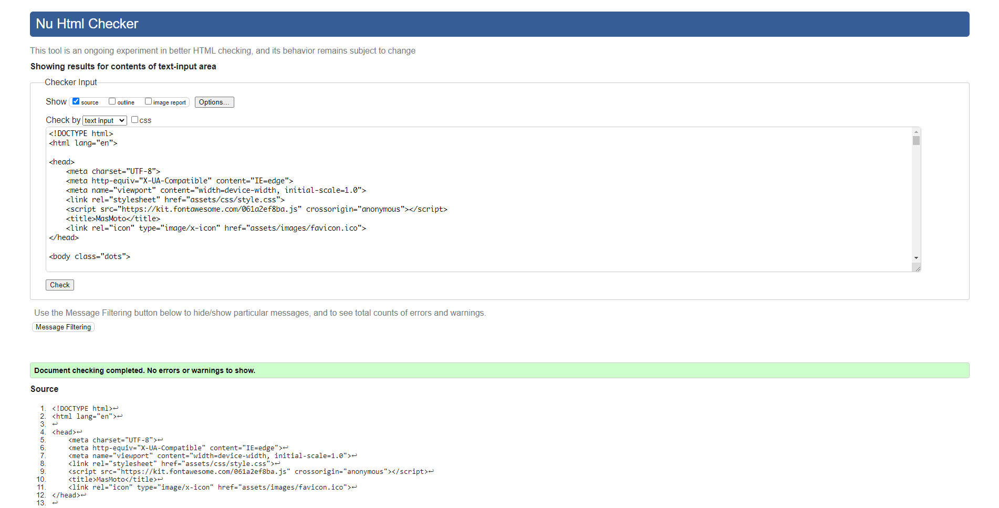

  

  

  
Specs Page

  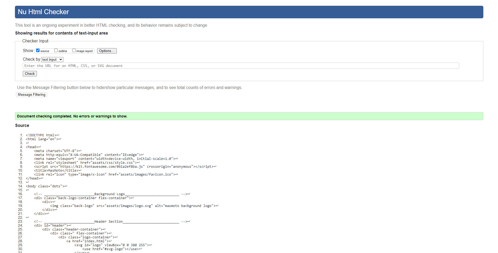

  

  

  
Quiz Page

  

  

  

  
Paint Shop Page

  

  

  

  
Links Page

  

  

   
  

  
Style.css

  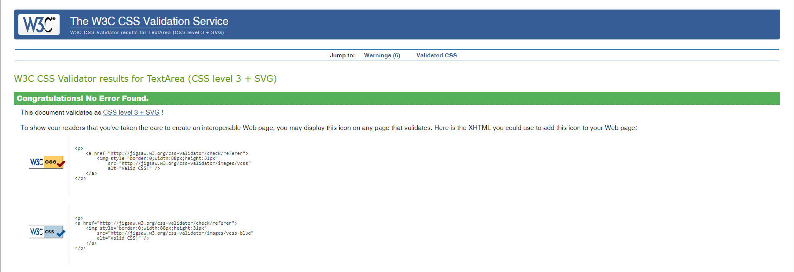

  

   
  

  
Index JS

  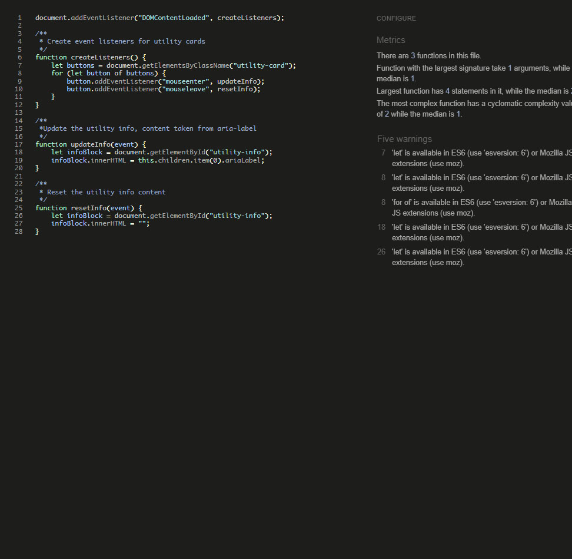

  

  

  
Specs JS

  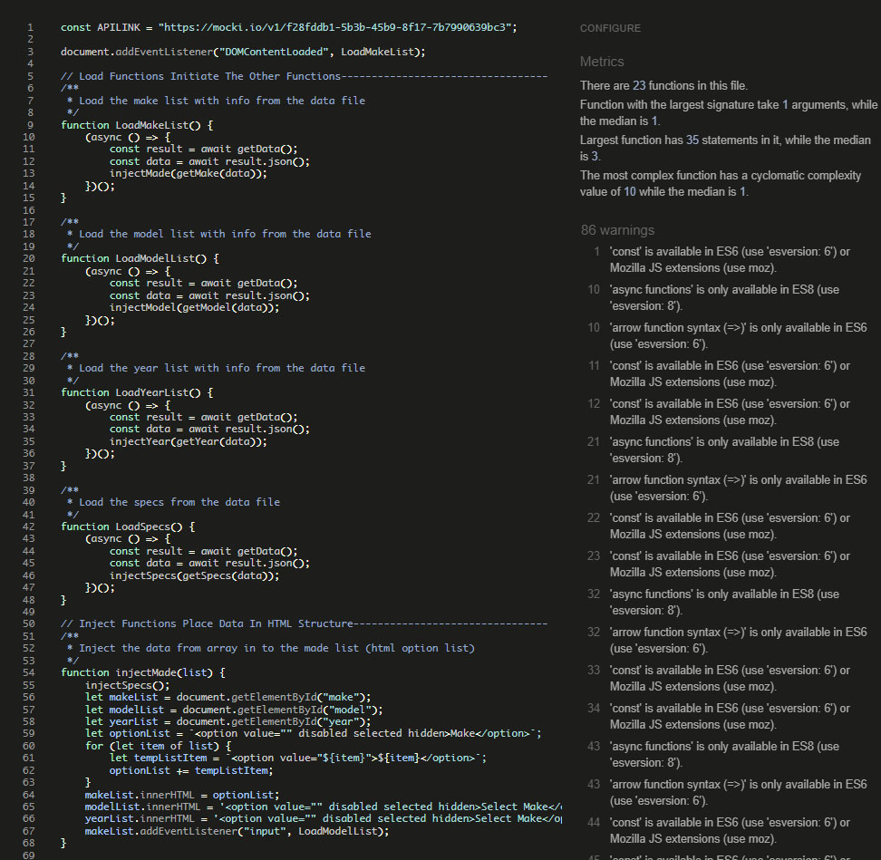

  

  

  
Quiz JS

  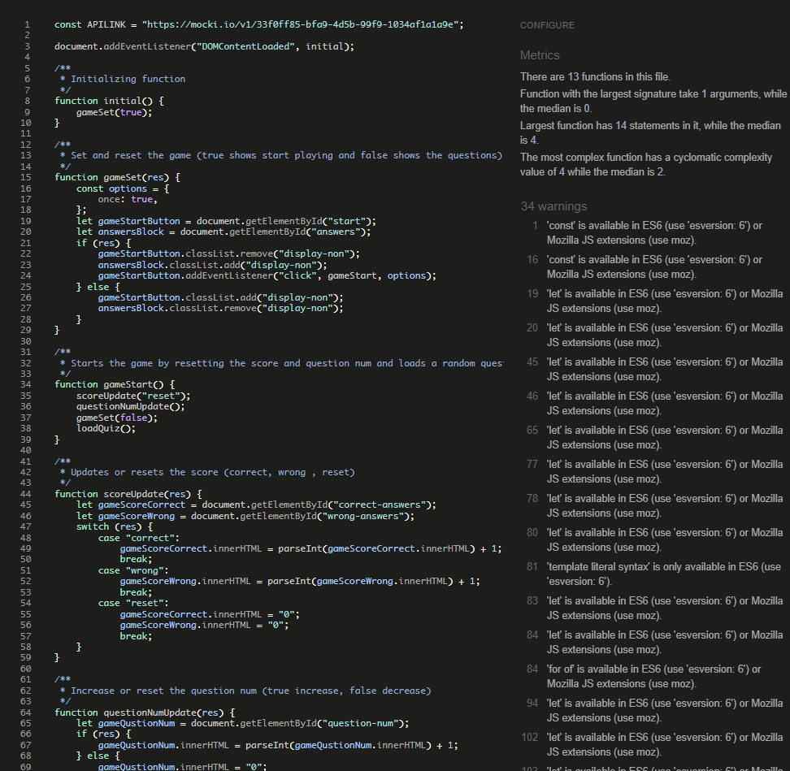

  

  

  
Paint JS

  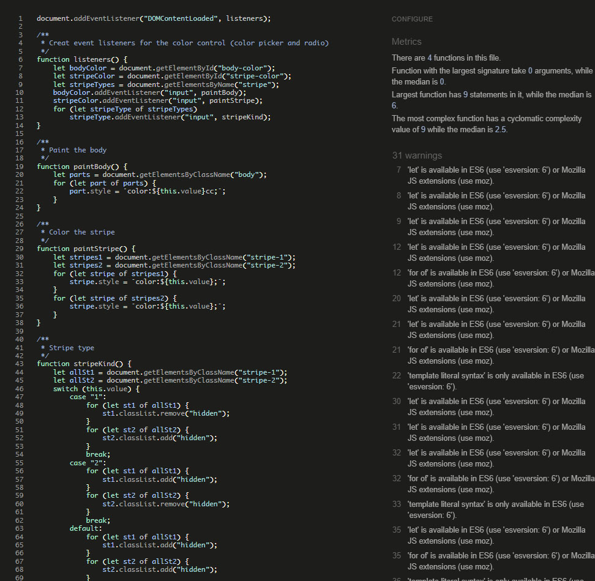

  

  

  
Links JS

  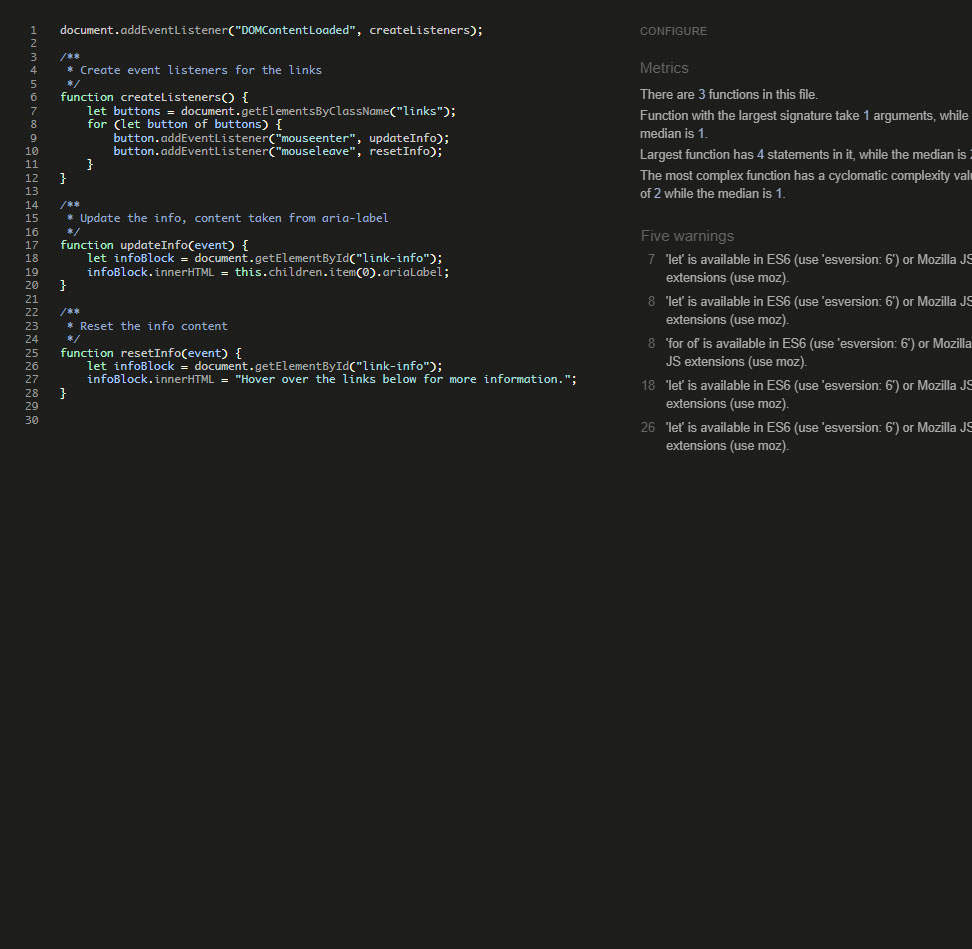

  

- - -

### Lighthouse

I used Lighthouse within the Chrome Developer Tools to test the performance, accessibility, best practices and SEO of the website.

Overall, the lighthouse scores are very good, with one or two things that could be improved. To achieve better scores I converted all images to the webp format.

Index Page

Desktop

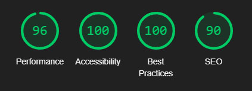

Mobile

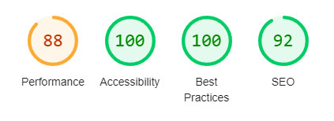

Specs Page

Desktop

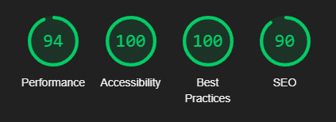

Mobile

Quiz Page

Desktop

Mobile

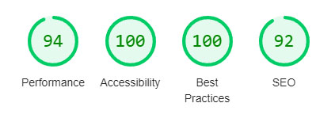

Paint Shop Page

Desktop

Mobile

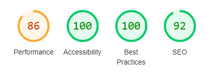

Links Page

Desktop

Mobile

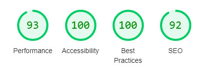

- - -

## MANUAL TESTING

### Testing User Stories

`Visitor Goals`

| Goals | How are they achieved? | Links & Images |
| :--- | :--- | :--- |
|To be able to view the site on a range of device sizes.| By using multiple break point for common used devices and implementing UI responsiveness CSS rules.|[1200px](documentation/resp-1200.jpg), [950px](documentation/resp-950.jpg), [768px](documentation/resp-768.jpg), [480px](documentation/resp-480.jpg).
|To be able to navigate through the website with ease.| By using a navigation bar on the top of the page with UI interactions.| [Navigation Bar](documentation/anim-nav.gif).
|To be able to test ones knowledge regarding riding motorcycles.| By using a quiz page to test ones knowledge.| [Quiz Page](documentation/page-quiz.jpg).
|To provide the user with relevant information regarding motorcycles.| By using a quiz page, a motorcycles specs page, and some useful links page.| [Quiz Page](documentation/page-quiz.jpg), [Specs Page](documentation/page-specs.jpg), [Links Page](documentation/page-links.jpg).
|To provide the user with a way to choose motorcycle color scheme.| By using a virtual Paint Shop page.| [Paint Shop Page](documentation/page-paint.jpg), [Paint Process](documentation/anim-paint.gif).

`First Time Visitor Goals`

| Goals | How are they achieved? | Images |
| :--- | :--- | :--- |
|I want to know what type of motorcycle I want.| By Checking motorcycles specs page.|[Specs Page](documentation/page-specs.jpg).
|I want to see some photos of motorcycles.| By Checking motorcycles specs and links page.|[Specs Page](documentation/page-specs.jpg), [Links Page](documentation/page-links.jpg).
|I want to check a motorcycle specs.| By Checking motorcycles specs page.|[Specs Page](documentation/page-specs.jpg).
|I want to find a suitable paintjob for me.| By Checking the Paint Shop page.|[Paint Shop Page](documentation/page-paint.jpg), [Paint Process](documentation/anim-paint.gif).
|I want to check some useful websites.| By Checking the Links page or the footer links.|[Links Page](documentation/page-links.jpg), [Footer Links](documentation/anim-footer.gif).

`Returning Visitor Goals`

| Goals | How are they achieved? | Images |
| :--- | :--- | :--- |
|I want to check a motorcycle specs.| By Checking motorcycles specs page.|[Specs Page](documentation/page-specs.jpg).
|I want to find a suitable paintjob for me.|  By Checking the Paint Shop page.|[Paint Shop Page](documentation/page-paint.jpg), [Paint Process](documentation/anim-paint.gif).
|I want to check some useful links.|By Checking the Links page or the footer links.|[Links Page](documentation/page-links.jpg), [Footer Links](documentation/anim-footer.gif).
- - -

### Full Testing

Full testing was performed on the following devices, and additional testing for other devices was carried out using developer tools:

windows laptop, ultrawide 20" monitor, 16:9 24" monitor, 16:9 17" monitor.

Each device tested the site using the following browsers:

Google Chrome on Windows, Edge

`Index Page`

| Feature | Expected Outcome | Testing Performed | Result | Pass/Fail |
| --- | --- | --- | --- | --- |
| **NAVBAR** |  |  |  |  |
|  |  |  |  |  |
| Logo link | When clicked you are redirected to the home page | Clicked Logo | Redirected to home page | Pass|
| Navbar specs link | When clicked you are redirected to the specs page | Clicked link | Redirected to specs page | Pass |
| Navbar specs link - Hover | When hovered over converts to a red button with white font | Hovered over link | converted to a red button with white font | Pass |
| Navbar quiz link | When clicked you are redirected to the quiz page | Clicked link | Redirected to quiz page | Pass |
| Navbar quiz link - Hover | When hovered over converts to a red button with white font | Hovered over link | converted to a red button with white font | Pass |
| Navbar paint shop link | When clicked you are redirected to the paint shop page | Clicked link | Redirected to paint shop page | Pass |
| Navbar paint shop link - Hover | When hovered over converts to a white button with gray font | Hovered over link | converted to a white button with gray font | Pass |
| Navbar links link | When clicked you are redirected to the links page | Clicked link | Redirected to links page | Pass |
| Navbar links link - Hover | When hovered over converts to a white button with gray font | Hovered over link | converted to a white button with gray font | Pass |
| **UTILITIES** |  |  |  |  |
|  |  |  |  |  |
| Specs utility button | Directs to specs page | Clicked button | Directed to specs page | Pass |
| Specs utility button hover | Triggers animation and info appears | hover over button | Animation triggered and info appeared | Pass |
| Quiz utility button | Directs to Quiz page | Clicked button | Directed to Quiz page | Pass |
| Quiz utility button hover | Triggers animation and info appears | hover over button | Animation triggered and info appeared | Pass |
| Paint Shop utility button | Directs to Paint Shop page | Clicked button | Directed to Paint Shop page | Pass |
| Paint Shop utility button hover | Triggers animation and info appears | hover over button | Animation triggered and info appeared | Pass |
| Links utility button | Directs to Links page | Clicked button | Directed to Links page | Pass |
| Links utility button hover | Triggers animation and info appears | hover over button | Animation triggered and info appeared | Pass |
| **FOOTER** |  |  |  |  |
|  |  |  |  |  |
| HONDA footer logo link | Redirect to HONDA'S website in a separate page when clicked | Clicked the link| Redirected to HONDA'S website in a separate page | Pass |
| HONDA footer logo link hover | Logo color change when hover | Hover over the link| Logo color changed | Pass |
| KAWASAKI footer logo link | Redirect to KAWASAKI'S website in a separate page when clicked | Clicked the link| Redirected to KAWASAKI'S website in a separate page | Pass |
| KAWASAKI footer logo link hover | Logo color change when hover | Hover over the link| Logo color changed | Pass |
| SUZUKI footer logo link | Redirect to SUZUKI'S website in a separate page when clicked | Clicked the link| Redirected to SUZUKI'S website in a separate page | Pass |
| SUZUKI footer logo link hover | Logo color change when hover | Hover over the link| Logo color changed | Pass |
| YAMAHA footer logo link | Redirect to YAMAHA'S website in a separate page when clicked | Clicked the link| Redirected to YAMAHA'S website in a separate page | Pass |
| YAMAHA footer logo link hover | Logo color change when hover | Hover over the link| Logo color changed | Pass |
| BMW footer logo link | Redirect to BMW'S website in a separate page when clicked | Clicked the link| Redirected to BMW'S website in a separate page | Pass |
| BMW footer logo link hover | Logo color change when hover | Hover over the link| Logo color changed | Pass |
| DUCATI footer logo link | Redirect to DUCATI'S website in a separate page when clicked | Clicked the link| Redirected to DUCATI'S website in a separate page | Pass |
| DUCATI footer logo link hover | Logo color change when hover | Hover over the link| Logo color changed | Pass |

`Specs Page`

| Feature | Expected Outcome | Testing Performed | Result | Pass/Fail |
| --- | --- | --- | --- | --- |
| **NAVBAR** |  |  |  |  |
|  |  |  |  |  |
| Logo link | When clicked you are redirected to the home page | Clicked Logo | Redirected to home page | Pass|
| Navbar specs link | When clicked you are redirected to the specs page | Clicked link | Redirected to specs page | Pass |
| Navbar specs link - Hover | When hovered over converts to a red button with white font | Hovered over link | converted to a red button with white font | Pass |
| Navbar quiz link | When clicked you are redirected to the quiz page | Clicked link | Redirected to quiz page | Pass |
| Navbar quiz link - Hover | When hovered over converts to a red button with white font | Hovered over link | converted to a red button with white font | Pass |
| Navbar paint shop link | When clicked you are redirected to the paint shop page | Clicked link | Redirected to paint shop page | Pass |
| Navbar paint shop link - Hover | When hovered over converts to a white button with gray font | Hovered over link | converted to a white button with gray font | Pass |
| Navbar links link | When clicked you are redirected to the links page | Clicked link | Redirected to links page | Pass |
| Navbar links link - Hover | When hovered over converts to a white button with gray font | Hovered over link | converted to a white button with gray font | Pass |
| **UTILITIES** |  |  |  |  |
|  |  |  |  |  |
| Specs utility button | Directs to specs page | Clicked button | Directed to specs page | Pass |
| Specs utility button hover | Triggers animation and info appears | hover over button | Animation triggered and info appeared | Pass |
| Quiz utility button | Directs to Quiz page | Clicked button | Directed to Quiz page | Pass |
| Quiz utility button hover | Triggers animation and info appears | hover over button | Animation triggered and info appeared | Pass |
| Paint Shop utility button | Directs to Paint Shop page | Clicked button | Directed to Paint Shop page | Pass |
| Paint Shop utility button hover | Triggers animation and info appears | hover over button | Animation triggered and info appeared | Pass |
| Links utility button | Directs to Links page | Clicked button | Directed to Links page | Pass |
| Links utility button hover | Triggers animation and info appears | hover over button | Animation triggered and info appeared | Pass |
| **FOOTER** |  |  |  |  |
|  |  |  |  |  |
| HONDA footer logo link | Redirect to HONDA'S website in a separate page when clicked | Clicked the link| Redirected to HONDA'S website in a separate page | Pass |
| HONDA footer logo link hover | Logo color change when hover | Hover over the link| Logo color changed | Pass |
| KAWASAKI footer logo link | Redirect to KAWASAKI'S website in a separate page when clicked | Clicked the link| Redirected to KAWASAKI'S website in a separate page | Pass |
| KAWASAKI footer logo link hover | Logo color change when hover | Hover over the link| Logo color changed | Pass |
| SUZUKI footer logo link | Redirect to SUZUKI'S website in a separate page when clicked | Clicked the link| Redirected to SUZUKI'S website in a separate page | Pass |
| SUZUKI footer logo link hover | Logo color change when hover | Hover over the link| Logo color changed | Pass |
| YAMAHA footer logo link | Redirect to YAMAHA'S website in a separate page when clicked | Clicked the link| Redirected to YAMAHA'S website in a separate page | Pass |
| YAMAHA footer logo link hover | Logo color change when hover | Hover over the link| Logo color changed | Pass |
| BMW footer logo link | Redirect to BMW'S website in a separate page when clicked | Clicked the link| Redirected to BMW'S website in a separate page | Pass |
| BMW footer logo link hover | Logo color change when hover | Hover over the link| Logo color changed | Pass |
| DUCATI footer logo link | Redirect to DUCATI'S website in a separate page when clicked | Clicked the link| Redirected to DUCATI'S website in a separate page | Pass |
| DUCATI footer logo link hover | Logo color change when hover | Hover over the link| Logo color changed | Pass |
| **DROPDOWN MENU** |  |  |  |  |
|  |  |  |  |  |
| Make dropdown menu | Opens menu options when clicked | Clicked the menu| Opened menu options | Pass |
| Make dropdown menu select option | Select make option and loads the model dropdown menu when clicked | Clicked the option| Selected a make option and loaded the model dropdown menu | Pass |
| Model dropdown menu | Opens menu options when clicked | Clicked the menu| Opened menu options | Pass |
| Model dropdown menu select option | Select model option and loads the year dropdown menu when clicked | Clicked the option| Selected a model option and loaded the year dropdown menu | Pass |
| Year dropdown menu | Opens menu options when clicked | Clicked the menu| Opened menu options | Pass |
| Year dropdown menu select option | Select year option and loads Specs and image section when clicked | Clicked the option| Selected year option and loaded Specs and image section | Pass |

`Quiz Page`

| Feature | Expected Outcome | Testing Performed | Result | Pass/Fail |
| --- | --- | --- | --- | --- |
| **NAVBAR** |  |  |  |  |
|  |  |  |  |  |
| Logo link | When clicked you are redirected to the home page | Clicked Logo | Redirected to home page | Pass|
| Navbar specs link | When clicked you are redirected to the specs page | Clicked link | Redirected to specs page | Pass |
| Navbar specs link - Hover | When hovered over converts to a red button with white font | Hovered over link | converted to a red button with white font | Pass |
| Navbar quiz link | When clicked you are redirected to the quiz page | Clicked link | Redirected to quiz page | Pass |
| Navbar quiz link - Hover | When hovered over converts to a red button with white font | Hovered over link | converted to a red button with white font | Pass |
| Navbar paint shop link | When clicked you are redirected to the paint shop page | Clicked link | Redirected to paint shop page | Pass |
| Navbar paint shop link - Hover | When hovered over converts to a white button with gray font | Hovered over link | converted to a white button with gray font | Pass |
| Navbar links link | When clicked you are redirected to the links page | Clicked link | Redirected to links page | Pass |
| Navbar links link - Hover | When hovered over converts to a white button with gray font | Hovered over link | converted to a white button with gray font | Pass |
| **UTILITIES** |  |  |  |  |
|  |  |  |  |  |
| Specs utility button | Directs to specs page | Clicked button | Directed to specs page | Pass |
| Specs utility button hover | Triggers animation and info appears | hover over button | Animation triggered and info appeared | Pass |
| Quiz utility button | Directs to Quiz page | Clicked button | Directed to Quiz page | Pass |
| Quiz utility button hover | Triggers animation and info appears | hover over button | Animation triggered and info appeared | Pass |
| Paint Shop utility button | Directs to Paint Shop page | Clicked button | Directed to Paint Shop page | Pass |
| Paint Shop utility button hover | Triggers animation and info appears | hover over button | Animation triggered and info appeared | Pass |
| Links utility button | Directs to Links page | Clicked button | Directed to Links page | Pass |
| Links utility button hover | Triggers animation and info appears | hover over button | Animation triggered and info appeared | Pass |
| **FOOTER** |  |  |  |  |
|  |  |  |  |  |
| HONDA footer logo link | Redirect to HONDA'S website in a separate page when clicked | Clicked the link| Redirected to HONDA'S website in a separate page | Pass |
| HONDA footer logo link hover | Logo color change when hover | Hover over the link| Logo color changed | Pass |
| KAWASAKI footer logo link | Redirect to KAWASAKI'S website in a separate page when clicked | Clicked the link| Redirected to KAWASAKI'S website in a separate page | Pass |
| KAWASAKI footer logo link hover | Logo color change when hover | Hover over the link| Logo color changed | Pass |
| SUZUKI footer logo link | Redirect to SUZUKI'S website in a separate page when clicked | Clicked the link| Redirected to SUZUKI'S website in a separate page | Pass |
| SUZUKI footer logo link hover | Logo color change when hover | Hover over the link| Logo color changed | Pass |
| YAMAHA footer logo link | Redirect to YAMAHA'S website in a separate page when clicked | Clicked the link| Redirected to YAMAHA'S website in a separate page | Pass |
| YAMAHA footer logo link hover | Logo color change when hover | Hover over the link| Logo color changed | Pass |
| BMW footer logo link | Redirect to BMW'S website in a separate page when clicked | Clicked the link| Redirected to BMW'S website in a separate page | Pass |
| BMW footer logo link hover | Logo color change when hover | Hover over the link| Logo color changed | Pass |
| DUCATI footer logo link | Redirect to DUCATI'S website in a separate page when clicked | Clicked the link| Redirected to DUCATI'S website in a separate page | Pass |
| DUCATI footer logo link hover | Logo color change when hover | Hover over the link| Logo color changed | Pass |
| **QUIZ** |  |  |  |  |
|  |  |  |  |  |
| Start playing button | Button disappears and the answers block appears with the first question, the question and score counter resets, the game starts | Clicked the button | Button disappeared and the answers block appeared with the first question, the question and score counter reset the game started | Pass |
| Start playing button hover | Button background color changes from red to green when hovered | Hovered over the button | Button background color changed from red to green | Pass |
| Answer button | Button color changes to green, and correct message appears, and correct counter increases by one, and question counter increases by one, if correct answer clicked | Clicked the button correct answer | Button color changed to green, and correct message appeared, and correct counter increased by one, and question counter increased by one. | Pass |
| Answer button | Button color changes to red and correct answer button changes color to green, and wrong message appears, and wrong counter increases by one, and question counter increases by one, if wrong answer clicked | Clicked the button wrong answer | Button color changed to red and correct answer button changed color to green, and wrong counter increased by one, and question counter increased by one, and wrong message appeared | Pass |
| Answer button hover| Inside shadow appears when hovered on | Hovered over the button | Inside shadow appeared | Pass |
| ten questions counter reach| Question block disappears, and start playing button appears, and result message appears, the game ends. | Answered ten questions | Question block disappeared, and start playing button appeared, and result message appeared, the game ended. | Pass |

`Paint Shop Page`

| Feature | Expected Outcome | Testing Performed | Result | Pass/Fail |
| --- | --- | --- | --- | --- |
| **NAVBAR** |  |  |  |  |
|  |  |  |  |  |
| Logo link | When clicked you are redirected to the home page | Clicked Logo | Redirected to home page | Pass|
| Navbar specs link | When clicked you are redirected to the specs page | Clicked link | Redirected to specs page | Pass |
| Navbar specs link - Hover | When hovered over converts to a red button with white font | Hovered over link | converted to a red button with white font | Pass |
| Navbar quiz link | When clicked you are redirected to the quiz page | Clicked link | Redirected to quiz page | Pass |
| Navbar quiz link - Hover | When hovered over converts to a red button with white font | Hovered over link | converted to a red button with white font | Pass |
| Navbar paint shop link | When clicked you are redirected to the paint shop page | Clicked link | Redirected to paint shop page | Pass |
| Navbar paint shop link - Hover | When hovered over converts to a white button with gray font | Hovered over link | converted to a white button with gray font | Pass |
| Navbar links link | When clicked you are redirected to the links page | Clicked link | Redirected to links page | Pass |
| Navbar links link - Hover | When hovered over converts to a white button with gray font | Hovered over link | converted to a white button with gray font | Pass |
| **UTILITIES** |  |  |  |  |
|  |  |  |  |  |
| Specs utility button | Directs to specs page | Clicked button | Directed to specs page | Pass |
| Specs utility button hover | Triggers animation and info appears | hover over button | Animation triggered and info appeared | Pass |
| Quiz utility button | Directs to Quiz page | Clicked button | Directed to Quiz page | Pass |
| Quiz utility button hover | Triggers animation and info appears | hover over button | Animation triggered and info appeared | Pass |
| Paint Shop utility button | Directs to Paint Shop page | Clicked button | Directed to Paint Shop page | Pass |
| Paint Shop utility button hover | Triggers animation and info appears | hover over button | Animation triggered and info appeared | Pass |
| Links utility button | Directs to Links page | Clicked button | Directed to Links page | Pass |
| Links utility button hover | Triggers animation and info appears | hover over button | Animation triggered and info appeared | Pass |
| **FOOTER** |  |  |  |  |
|  |  |  |  |  |
| HONDA footer logo link | Redirect to HONDA'S website in a separate page when clicked | Clicked the link| Redirected to HONDA'S website in a separate page | Pass |
| HONDA footer logo link hover | Logo color change when hover | Hover over the link| Logo color changed | Pass |
| KAWASAKI footer logo link | Redirect to KAWASAKI'S website in a separate page when clicked | Clicked the link| Redirected to KAWASAKI'S website in a separate page | Pass |
| KAWASAKI footer logo link hover | Logo color change when hover | Hover over the link| Logo color changed | Pass |
| SUZUKI footer logo link | Redirect to SUZUKI'S website in a separate page when clicked | Clicked the link| Redirected to SUZUKI'S website in a separate page | Pass |
| SUZUKI footer logo link hover | Logo color change when hover | Hover over the link| Logo color changed | Pass |
| YAMAHA footer logo link | Redirect to YAMAHA'S website in a separate page when clicked | Clicked the link| Redirected to YAMAHA'S website in a separate page | Pass |
| YAMAHA footer logo link hover | Logo color change when hover | Hover over the link| Logo color changed | Pass |
| BMW footer logo link | Redirect to BMW'S website in a separate page when clicked | Clicked the link| Redirected to BMW'S website in a separate page | Pass |
| BMW footer logo link hover | Logo color change when hover | Hover over the link| Logo color changed | Pass |
| DUCATI footer logo link | Redirect to DUCATI'S website in a separate page when clicked | Clicked the link| Redirected to DUCATI'S website in a separate page | Pass |
| DUCATI footer logo link hover | Logo color change when hover | Hover over the link| Logo color changed | Pass |
| **PAINT SHOP** |  |  |  |  |
|  |  |  |  |  |
| Body color picker button | Opens color picker window when clicked | Clicked the button | Opened color picker window  | Pass |
| Body color picker button hover | A hand pointer appears when hovered over | Hovered over the button | A hand pointer appeared | Pass |
| Stripe color picker button | Opens color picker window when clicked | Clicked the button | Opened color picker window  | Pass |
| Stripe color picker button hover | A hand pointer appears when hovered over | Hovered over the button | A hand pointer appeared | Pass |
| Stripe radio button none | Selects non stripe type when clicked, no stripes appears on the motorcycle image | Clicked the button | Selected non stripe type, no stripes appeared on the motorcycle image | Pass |
| Stripe radio button classic | Selects classic type when clicked, classic stripes appears on the motorcycle image | Clicked the button | Selected classic type, classic stripes appeared on the motorcycle image | Pass |
| Stripe radio button wave | Selects wave type when clicked, wave stripes appears on the motorcycle image | Clicked the button | Selected wave type, wave stripes appeared on the motorcycle image | Pass |
| Stripe radio button hover | Triggers hover animation darker color | Hovered over the button | Triggered hover animation darker color | Pass |
| Body color picker window | Selects a color when clicked and colors the motorcycle body with it | Clicked in the window | Selected a color and colored the motorcycle body with it | Pass |
| stripe color picker window | Selects a color when clicked and colors the motorcycle stripes with it | Clicked in the window | Selected a color and colored the motorcycle stripes with it | Pass |

`Links Page`

| Feature | Expected Outcome | Testing Performed | Result | Pass/Fail |
| --- | --- | --- | --- | --- |
| **NAVBAR** |  |  |  |  |
|  |  |  |  |  |
| Logo link | When clicked you are redirected to the home page | Clicked Logo | Redirected to home page | Pass|
| Navbar specs link | When clicked you are redirected to the specs page | Clicked link | Redirected to specs page | Pass |
| Navbar specs link - Hover | When hovered over converts to a red button with white font | Hovered over link | converted to a red button with white font | Pass |
| Navbar quiz link | When clicked you are redirected to the quiz page | Clicked link | Redirected to quiz page | Pass |
| Navbar quiz link - Hover | When hovered over converts to a red button with white font | Hovered over link | converted to a red button with white font | Pass |
| Navbar paint shop link | When clicked you are redirected to the paint shop page | Clicked link | Redirected to paint shop page | Pass |
| Navbar paint shop link - Hover | When hovered over converts to a white button with gray font | Hovered over link | converted to a white button with gray font | Pass |
| Navbar links link | When clicked you are redirected to the links page | Clicked link | Redirected to links page | Pass |
| Navbar links link - Hover | When hovered over converts to a white button with gray font | Hovered over link | converted to a white button with gray font | Pass |
| **UTILITIES** |  |  |  |  |
|  |  |  |  |  |
| Specs utility button | Directs to specs page | Clicked button | Directed to specs page | Pass |
| Specs utility button hover | Triggers animation and info appears | hover over button | Animation triggered and info appeared | Pass |
| Quiz utility button | Directs to Quiz page | Clicked button | Directed to Quiz page | Pass |
| Quiz utility button hover | Triggers animation and info appears | hover over button | Animation triggered and info appeared | Pass |
| Paint Shop utility button | Directs to Paint Shop page | Clicked button | Directed to Paint Shop page | Pass |
| Paint Shop utility button hover | Triggers animation and info appears | hover over button | Animation triggered and info appeared | Pass |
| Links utility button | Directs to Links page | Clicked button | Directed to Links page | Pass |
| Links utility button hover | Triggers animation and info appears | hover over button | Animation triggered and info appeared | Pass |
| **FOOTER** |  |  |  |  |
|  |  |  |  |  |
| HONDA footer logo link | Redirect to HONDA'S website in a separate page when clicked | Clicked the link| Redirected to HONDA'S website in a separate page | Pass |
| HONDA footer logo link hover | Logo color change when hover | Hover over the link| Logo color changed | Pass |
| KAWASAKI footer logo link | Redirect to KAWASAKI'S website in a separate page when clicked | Clicked the link| Redirected to KAWASAKI'S website in a separate page | Pass |
| KAWASAKI footer logo link hover | Logo color change when hover | Hover over the link| Logo color changed | Pass |
| SUZUKI footer logo link | Redirect to SUZUKI'S website in a separate page when clicked | Clicked the link| Redirected to SUZUKI'S website in a separate page | Pass |
| SUZUKI footer logo link hover | Logo color change when hover | Hover over the link| Logo color changed | Pass |
| YAMAHA footer logo link | Redirect to YAMAHA'S website in a separate page when clicked | Clicked the link| Redirected to YAMAHA'S website in a separate page | Pass |
| YAMAHA footer logo link hover | Logo color change when hover | Hover over the link| Logo color changed | Pass |
| BMW footer logo link | Redirect to BMW'S website in a separate page when clicked | Clicked the link| Redirected to BMW'S website in a separate page | Pass |
| BMW footer logo link hover | Logo color change when hover | Hover over the link| Logo color changed | Pass |
| DUCATI footer logo link | Redirect to DUCATI'S website in a separate page when clicked | Clicked the link| Redirected to DUCATI'S website in a separate page | Pass |
| DUCATI footer logo link hover | Logo color change when hover | Hover over the link| Logo color changed | Pass |
| **LINKS** |  |  |  |  |
|  |  |  |  |  |
| Cycle Ergo link | Redirects to Cycle Ergo website in a separate page when clicked | Clicked the link | Redirected to Cycle Ergo website in a separate page | Pass |
| Cycle Ergo link hover | Triggers hover animation red background button with white font and increase the size, info regarding the link appears when hovered | Hovered over the link | Triggered hover animation red background button with white font and increased the size, info regarding the link appeared | Pass |
| MCN link | Redirects to MCN website in a separate page when clicked | Clicked the link | Redirected to MCN website in a separate page | Pass |
| MCN link hover | Triggers hover animation red background button with white font and increase the size, info regarding the link appears when hovered | Hovered over the link | Triggered hover animation red background button with white font and increased the size, info regarding the link appeared | Pass |
| MC Rider link | Redirects to MC Rider website in a separate page when clicked | Clicked the link | Redirected to MC Rider website in a separate page | Pass |
| MC Rider link hover | Triggers hover animation red background button with white font and increase the size, info regarding the link appears when hovered | Hovered over the link | Triggered hover animation red background button with white font and increased the size, info regarding the link appeared | Pass |

---

### Known Bugs

| Known Bug No | Bug Issue | Plan to Resolve |
| :--- | :--- | :--- |
| 1 | The image in specs sections does not fully fill the container when it is the only image in it. This happens while resizing the screen | try tinkering the CSS a little bit, one of the options I tried and worked was to use another blank image as a background but I think there must be a better solution.|
| 2 | the back ground does not fully extend to the whole body when scaling to 50% | need to modify the html structure. |

### Solved Bugs

| Bug No | Bug Issue | How Resolved |
| :--- | :--- | :--- |
| 1 | Embedded SVG files take a place in the document work flow and takes empty space at the end of the body  | gave the tags a class with display property set to none|

Back to [README.md](README.md)